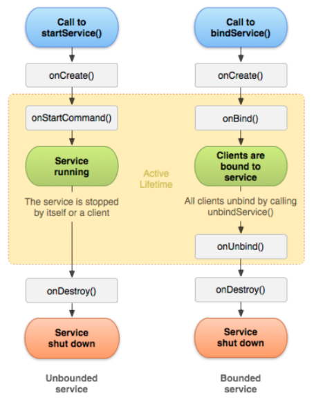

= Service

Recurso usado para operações que são executadas em segundo plano. Não oferece interface gráfica para interação com o usuário. Geralmente são indicadas
para operações longas. Um exemplo clássico de uso: uma música sendo reproduzida mesmo quando você está usando outro aplicativo.

image::https://img.youtube.com/vi/ROk-YrZKYCg/0.jpg[width=640, height=480, link="https://www.youtube.com/watch?v=ROk-YrZKYCg"]

A figura 1 mostra o ciclo de vida do service

- Referência da figura 1: GOOGLE DEVELOPERS. Visão geral dos serviços. Disponível em: https://developer.android.com/guide/components/services. Acesso: 28 ago. 2025.

Exemplo 01 (music service):

- No arquivo AndroidManifest.xml acrescente as tags:
    <uses-permission android:name="android.permission.FOREGROUND_SERVICE"/>
    <uses-permission android:name="android.permission.FOREGROUND_SERVICE_MEDIA_PLAYBACK"/>
    <uses-permission android:name="android.permission.POST_NOTIFICATIONS"/>

    <service
            android:name=".MusicService"
            android:exported="false"
            android:foregroundServiceType="mediaPlayback"/>

- NotificationHelper.java
[source,java]
import android.app.Notification;
import android.app.NotificationChannel;
import android.app.NotificationManager;
import android.content.Context;
import androidx.core.app.NotificationCompat;
public class NotificationHelper {
    private static final String CHANNEL_ID = "music_channel";
    public static Notification createNotification(Context context) {
        NotificationManager manager = (NotificationManager)
                context.getSystemService(Context.NOTIFICATION_SERVICE);
        if (android.os.Build.VERSION.SDK_INT >= android.os.Build.VERSION_CODES.O) {
            NotificationChannel channel = new NotificationChannel(
                    CHANNEL_ID,
                    "Music Service",
                    NotificationManager.IMPORTANCE_LOW
            );
            manager.createNotificationChannel(channel);
        }
        return new NotificationCompat.Builder(context, CHANNEL_ID)
                .setContentTitle("Reproduzindo música")
                .setContentText("A música está tocando em segundo plano")
                .setSmallIcon(android.R.drawable.ic_media_play)
                .setOngoing(true) // notificação persistente
                .build();
    }
}

- MusicService.java
[source,java]
import android.app.Notification;
import android.app.Service;
import android.content.Intent;
import android.media.MediaPlayer;
import android.os.IBinder;
import androidx.annotation.Nullable;
public class MusicService extends Service {
    private MediaPlayer mediaPlayer;
    @Override
    public void onCreate() {
        super.onCreate();
        mediaPlayer = MediaPlayer.create(this, R.raw.music);
        mediaPlayer.setLooping(true);
    }
    @Override
    public int onStartCommand(Intent intent, int flags, int startId) {
        Notification notification = NotificationHelper.createNotification(this);
        startForeground(1, notification);
        if (!mediaPlayer.isPlaying()) {
            mediaPlayer.start();
        }
        return START_STICKY;
    }
    @Override
    public void onDestroy() {
        if (mediaPlayer != null && mediaPlayer.isPlaying()) {
            mediaPlayer.stop();
            mediaPlayer.release();
        }
        super.onDestroy();
    }
    @Nullable
    @Override
    public IBinder onBind(Intent intent) {
        return null; 
    }
}

- activity_main.xml
[source,java]
<?xml version="1.0" encoding="utf-8"?>
<LinearLayout xmlns:android="http://schemas.android.com/apk/res/android"
    android:orientation="vertical"
    android:gravity="center"
    android:layout_width="match_parent"
    android:layout_height="match_parent"
    android:padding="24dp">
    <Button
        android:id="@+id/btnStart"
        android:layout_width="wrap_content"
        android:layout_height="wrap_content"
        android:text="Iniciar Música"/>
    <Button
        android:id="@+id/btnStop"
        android:layout_width="wrap_content"
        android:layout_height="wrap_content"
        android:text="Parar Música"
        android:layout_marginTop="16dp"/>
</LinearLayout>

- MainActivity.java
[source,java]
import android.content.Intent;
import android.os.Bundle;
import android.widget.Button;
import androidx.appcompat.app.AppCompatActivity;
public class MainActivity extends AppCompatActivity {
    private Button btnStart, btnStop;
    @Override
    protected void onCreate(Bundle savedInstanceState) {
        super.onCreate(savedInstanceState);
        setContentView(R.layout.activity_main);
        btnStart = findViewById(R.id.btnStart);
        btnStop = findViewById(R.id.btnStop);
        btnStart.setOnClickListener(v -> {
            Intent intent = new Intent(this, MusicService.class);
            startService(intent); 
        });
        btnStop.setOnClickListener(v -> {
            Intent intent = new Intent(this, MusicService.class);
            stopService(intent); 
        });
    }
}

Exemplo 02 (HTTP service): 

