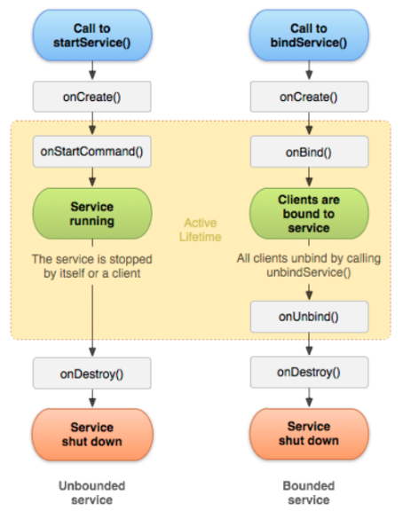

= Service

Recurso usado para operações que são executadas em segundo plano. Não oferece interface gráfica para interação com o usuário. Geralmente são indicadas
para operações longas. Um exemplo clássico de uso: uma música sendo reproduzida mesmo quando você está usando outro aplicativo.

image::https://img.youtube.com/vi/ROk-YrZKYCg/0.jpg[width=640, height=480, link="https://www.youtube.com/watch?v=ROk-YrZKYCg"]

A figura 1 mostra o ciclo de vida do service

- Referência da figura 1: GOOGLE DEVELOPERS. Visão geral dos serviços. Disponível em: https://developer.android.com/guide/components/services. Acesso: 28 ago. 2025.

Exemplo 01 (music service):

- No arquivo AndroidManifest.xml acrescente as tags:
    <uses-permission android:name="android.permission.FOREGROUND_SERVICE"/>
    <uses-permission android:name="android.permission.FOREGROUND_SERVICE_MEDIA_PLAYBACK"/>
    <uses-permission android:name="android.permission.POST_NOTIFICATIONS"/>

    <service
            android:name=".MusicService"
            android:exported="false"
            android:foregroundServiceType="mediaPlayback"/>

- NotificationHelper.java
[source,java]
import android.app.Notification;
import android.app.NotificationChannel;
import android.app.NotificationManager;
import android.content.Context;
import androidx.core.app.NotificationCompat;
public class NotificationHelper {
    private static final String CHANNEL_ID = "music_channel";
    public static Notification createNotification(Context context) {
        NotificationManager manager = (NotificationManager)
                context.getSystemService(Context.NOTIFICATION_SERVICE);
        if (android.os.Build.VERSION.SDK_INT >= android.os.Build.VERSION_CODES.O) {
            NotificationChannel channel = new NotificationChannel(
                    CHANNEL_ID,
                    "Music Service",
                    NotificationManager.IMPORTANCE_LOW
            );
            manager.createNotificationChannel(channel);
        }
        return new NotificationCompat.Builder(context, CHANNEL_ID)
                .setContentTitle("Reproduzindo música")
                .setContentText("A música está tocando em segundo plano")
                .setSmallIcon(android.R.drawable.ic_media_play)
                .setOngoing(true) // notificação persistente
                .build();
    }
}

- MusicService.java
[source,java]
import android.app.Notification;
import android.app.Service;
import android.content.Intent;
import android.media.MediaPlayer;
import android.os.IBinder;
import androidx.annotation.Nullable;
public class MusicService extends Service {
    private MediaPlayer mediaPlayer;
    @Override
    public void onCreate() {
        super.onCreate();
        mediaPlayer = MediaPlayer.create(this, R.raw.music);
        mediaPlayer.setLooping(true);
    }
    @Override
    public int onStartCommand(Intent intent, int flags, int startId) {
        Notification notification = NotificationHelper.createNotification(this);
        startForeground(1, notification);
        if (!mediaPlayer.isPlaying()) {
            mediaPlayer.start();
        }
        return START_STICKY;
    }
    @Override
    public void onDestroy() {
        if (mediaPlayer != null && mediaPlayer.isPlaying()) {
            mediaPlayer.stop();
            mediaPlayer.release();
        }
        super.onDestroy();
    }
    @Nullable
    @Override
    public IBinder onBind(Intent intent) {
        return null; 
    }
}

- activity_main.xml
[source,java]
<?xml version="1.0" encoding="utf-8"?>
<LinearLayout xmlns:android="http://schemas.android.com/apk/res/android"
    android:orientation="vertical"
    android:gravity="center"
    android:layout_width="match_parent"
    android:layout_height="match_parent"
    android:padding="24dp">
    <Button
        android:id="@+id/btnStart"
        android:layout_width="wrap_content"
        android:layout_height="wrap_content"
        android:text="Iniciar Música"/>
    <Button
        android:id="@+id/btnStop"
        android:layout_width="wrap_content"
        android:layout_height="wrap_content"
        android:text="Parar Música"
        android:layout_marginTop="16dp"/>
</LinearLayout>

- MainActivity.java
[source,java]
import android.content.Intent;
import android.os.Bundle;
import android.widget.Button;
import androidx.appcompat.app.AppCompatActivity;
public class MainActivity extends AppCompatActivity {
    private Button btnStart, btnStop;
    @Override
    protected void onCreate(Bundle savedInstanceState) {
        super.onCreate(savedInstanceState);
        setContentView(R.layout.activity_main);
        btnStart = findViewById(R.id.btnStart);
        btnStop = findViewById(R.id.btnStop);
        btnStart.setOnClickListener(v -> {
            Intent intent = new Intent(this, MusicService.class);
            startService(intent); 
        });
        btnStop.setOnClickListener(v -> {
            Intent intent = new Intent(this, MusicService.class);
            stopService(intent); 
        });
    }
}

Exemplo 02 (HTTP service): 

- No arquivo Gradle no campo DEPENDENCIES acrescente implementation ("com.google.code.gson:gson:2.10.1")

- No arquivo AndroidManifest.xml acrescente a tag:  
<uses-permission android:name="android.permission.INTERNET" />
<service
            android:name=".service.HttpService"
            android:exported="false"/>

- User.java
[source,java]
import com.google.gson.annotations.Expose;
import com.google.gson.annotations.SerializedName;
public class User {
    @SerializedName("id")
    @Expose
    private Integer id;
    @SerializedName("userId")
    @Expose
    private Integer userId;
    @SerializedName("title")
    @Expose
    private String title;
    @SerializedName("completed")
    @Expose
    private boolean completed;
    public Integer getId() {
        return id;
    }
    public void setId(Integer id) {
        this.id = id;
    }
    public Integer getUserId() {
        return userId;
    }
    public void setUserId(Integer userId) {
        this.userId = userId;
    }
    public String getTitle() {
        return title;
    }
    public void setTitle(String title) {
        this.title = title;
    }
    public boolean getCompleted() {
        return completed;
    }
    public void setCompleted(boolean completed) {
        this.completed = completed;
    }
    @Override
    public String toString() {
        return "User{" +
                "id=" + id +
                ", userId=" + userId +
                ", title='" + title + '\'' +
                ", completed='" + completed + '\'' +
                '}';
    }
}

- UserRepository.java
[source,java]
import android.content.Context;
import android.content.Intent;
import androidx.lifecycle.LiveData;
import androidx.lifecycle.MutableLiveData;
import com.example.servicehttp.model.User;
import com.example.servicehttp.service.HttpService;
public class UserRepository {
    private static UserRepository instance;
    private final MutableLiveData<User> userLiveData = new MutableLiveData<>();
    private UserRepository() {}
    public static synchronized UserRepository getInstance() {
        if (instance == null) {
            instance = new UserRepository();
        }
        return instance;
    }
    public LiveData<User> getUserLiveData() {
        return userLiveData;
    }
    public void fetchUser(Context context) {
        Intent intent = new Intent(context, HttpService.class);
        context.startService(intent);
    }
    public void postUser(User user) {
        userLiveData.postValue(user);
    }
}

- HttpHelper.java
[source,java]
import android.util.Log;
import com.example.servicehttp.model.User;
import com.google.gson.Gson;
import java.io.BufferedReader;
import java.io.InputStreamReader;
import java.net.HttpURLConnection;
import java.net.URL;
public class HttpHelper {
    public static final String URL = "https://jsonplaceholder.typicode.com/todos/1";
    public static User fetchUser() {
        User user = null;
        try {
            URL url = new URL(URL);
            HttpURLConnection conn = (HttpURLConnection) url.openConnection();
            conn.setRequestMethod("GET");
            conn.setConnectTimeout(5000);
            conn.setReadTimeout(5000);
            int responseCode = conn.getResponseCode();
            if (responseCode == HttpURLConnection.HTTP_OK) {
                BufferedReader reader = new BufferedReader(
                        new InputStreamReader(conn.getInputStream())
                );
                StringBuilder sb = new StringBuilder();
                String line;
                while ((line = reader.readLine()) != null) {
                    sb.append(line);
                }
                reader.close();
                user = new Gson().fromJson(sb.toString(), User.class);
            } else {
                Log.e("HttpHelper", "Erro HTTP: " + responseCode);
            }
            conn.disconnect();
        } catch (Exception e) {
            Log.e("HttpHelper", "Erro na requisição", e);
        }
        return user;
    }
}

- HttpService.java
[source,java]
import android.app.Service;
import android.content.Intent;
import android.os.IBinder;
import android.util.Log;
import com.example.servicehttp.model.User;
import com.example.servicehttp.repository.UserRepository;
import java.util.concurrent.ExecutorService;
import java.util.concurrent.Executors;
public class HttpService extends Service {
    private final ExecutorService executor = Executors.newSingleThreadExecutor();
    @Override
    public int onStartCommand(Intent intent, int flags, int startId) {
        executor.execute(() -> {
            User user = HttpHelper.fetchUser();
            Log.d("HTTP",user.toString());
            if (user != null) {
                Log.d("USER",user.toString());
                UserRepository.getInstance().postUser(user);
            }
            stopSelf();
        });
        return START_NOT_STICKY;
    }
    @Override
    public IBinder onBind(Intent intent) {
        return null;
    }
}

- UserViewModel.java
[source,java]
import android.app.Application;
import androidx.annotation.NonNull;
import androidx.lifecycle.AndroidViewModel;
import androidx.lifecycle.LiveData;
import com.example.servicehttp.model.User;
import com.example.servicehttp.repository.UserRepository;
public class UserViewModel extends AndroidViewModel {
    private final UserRepository repository;
    public UserViewModel(@NonNull Application application) {
        super(application);
        repository = UserRepository.getInstance();
    }
    public LiveData<User> getUserLiveData() {
        return repository.getUserLiveData();
    }
    public void fetchUser() {
        repository.fetchUser(getApplication().getApplicationContext());
    }
}

- activity_main.xml
[source,xml]
<?xml version="1.0" encoding="utf-8"?>
<LinearLayout xmlns:android="http://schemas.android.com/apk/res/android"
    android:orientation="vertical"
    android:gravity="center"
    android:padding="24dp"
    android:layout_width="match_parent"
    android:layout_height="match_parent">
    <Button
        android:id="@+id/buttonHTTP"
        android:layout_width="wrap_content"
        android:layout_height="wrap_content"
        android:text="Solicitar dados"/>
    <TextView
        android:id="@+id/textViewResultado"
        android:layout_width="match_parent"
        android:layout_height="wrap_content"
        android:padding="16dp"
        android:textSize="16sp"
        android:text="Resultado"/>
</LinearLayout>

- MainActivity.java
[source,java]
import android.os.Bundle;
import android.widget.Button;
import android.widget.TextView;
import androidx.activity.ComponentActivity;
import androidx.lifecycle.ViewModelProvider;
import com.example.servicehttp.R;
import com.example.servicehttp.viewmodel.UserViewModel;
public class MainActivity extends ComponentActivity {
    private UserViewModel viewModel;
    private TextView textView;
    @Override
    protected void onCreate(Bundle savedInstanceState) {
        super.onCreate(savedInstanceState);
        setContentView(R.layout.activity_main);
        textView = findViewById(R.id.textViewResultado);
        Button button = findViewById(R.id.buttonHTTP);
        viewModel = new ViewModelProvider(this).get(UserViewModel.class);
        viewModel.getUserLiveData().observe(this, user -> {
            if (user != null) {
                textView.setText(user.toString());
            }
        });
        button.setOnClickListener(v -> viewModel.fetchUser());
    }
}

Neste exemplo usamos o SERVICE com a responsalibidade de realizar a solicitação HTTP e retornar o objeto USER. O SERVICE é um componente destinado à operações em segundo plano, portanto, pergunta-se neste caso como o app está visível, seria necessário o uso do SERVICE??

Exemplo 03(HTTP sem service):

- No arquivo Gradle no campo DEPENDENCIES acrescente implementation ("com.google.code.gson:gson:2.10.1")

- No arquivo AndroidManifest.xml acrescente a tag:  
<uses-permission android:name="android.permission.INTERNET" />

- User.java
[source,java]
import com.google.gson.annotations.Expose;
import com.google.gson.annotations.SerializedName;
public class User {
    @SerializedName("id")
    @Expose
    private Integer id;
    @SerializedName("userId")
    @Expose
    private Integer userId;
    @SerializedName("title")
    @Expose
    private String title;
    @SerializedName("completed")
    @Expose
    private boolean completed;
    public Integer getId() {
        return id;
    }
    public void setId(Integer id) {
        this.id = id;
    }
    public Integer getUserId() {
        return userId;
    }
    public void setUserId(Integer userId) {
        this.userId = userId;
    }
    public String getTitle() {
        return title;
    }
    public void setTitle(String title) {
        this.title = title;
    }
    public boolean getCompleted() {
        return completed;
    }
    public void setCompleted(boolean completed) {
        this.completed = completed;
    }
    @Override
    public String toString() {
        return "User{" +
                "id=" + id +
                ", userId=" + userId +
                ", title='" + title + '\'' +
                ", completed='" + completed + '\'' +
                '}';
    }
}

- UserRepository.java
[source,java]
import android.os.Handler;
import android.os.Looper;
import androidx.lifecycle.LiveData;
import androidx.lifecycle.MutableLiveData;
import java.util.concurrent.ExecutorService;
import java.util.concurrent.Executors;
public class UserRepository {
    private final MutableLiveData<User> userLiveData = new MutableLiveData<>();
    private final ExecutorService executor = Executors.newSingleThreadExecutor();
    private final Handler mainHandler = new Handler(Looper.getMainLooper());
    public LiveData<User> getUserLiveData() {
        return userLiveData;
    }
    public void fetchUser() {
        executor.execute(new Runnable() {
            @Override
            public void run() {
                final User user = HttpHelper.fetchUser();
                if (user != null) {
                    mainHandler.post(new Runnable() {
                        @Override
                        public void run() {
                            userLiveData.setValue(user);
                        }
                    });
                }
            }
        });
    }
}

- UserViewModel.java
[source,java]
import android.app.Application;
import androidx.annotation.NonNull;
import androidx.lifecycle.AndroidViewModel;
import androidx.lifecycle.LiveData;
public class UserViewModel extends AndroidViewModel {
    private final UserRepository repository;
    public UserViewModel(@NonNull Application application) {
        super(application);
        repository = new UserRepository();
    }
    public LiveData<User> getUserLiveData() {
        return repository.getUserLiveData();
    }
    public void fetchUser() {
        repository.fetchUser();
    }
}

- HttpHelper.java
[source,java]
import android.util.Log;
import com.google.gson.Gson;
import java.io.BufferedReader;
import java.io.InputStreamReader;
import java.net.HttpURLConnection;
import java.net.URL;
public class HttpHelper {
    public static final String URL = "https://jsonplaceholder.typicode.com/todos/1";
    public static User fetchUser() {
        User user = null;
        try {
            URL url = new URL(URL);
            HttpURLConnection conn = (HttpURLConnection) url.openConnection();
            conn.setRequestMethod("GET");
            conn.setConnectTimeout(5000);
            conn.setReadTimeout(5000);
            int responseCode = conn.getResponseCode();
            if (responseCode == HttpURLConnection.HTTP_OK) {
                BufferedReader reader = new BufferedReader(
                        new InputStreamReader(conn.getInputStream())
                );
                StringBuilder sb = new StringBuilder();
                String line;
                while ((line = reader.readLine()) != null) {
                    sb.append(line);
                }
                reader.close();
                user = new Gson().fromJson(sb.toString(), User.class);
            } else {
                Log.e("HttpHelper", "Erro HTTP: " + responseCode);
            }
            conn.disconnect();
        } catch (Exception e) {
            Log.e("HttpHelper", "Erro na requisição", e);
        }
        return user;
    }
}

- activity_main.xml
[source,xml]
<?xml version="1.0" encoding="utf-8"?>
<LinearLayout xmlns:android="http://schemas.android.com/apk/res/android"
    android:orientation="vertical"
    android:padding="16dp"
    android:layout_width="match_parent"
    android:layout_height="match_parent">
    <Button
        android:id="@+id/button"
        android:layout_width="wrap_content"
        android:layout_height="wrap_content"
        android:text="Solicitar dados" />
    <TextView
        android:id="@+id/textView"
        android:layout_width="match_parent"
        android:layout_height="wrap_content"
        android:paddingTop="16dp"
        android:text="Resultado:" />
</LinearLayout>

- MainActivity.java
[source,java]
import android.os.Bundle;
import android.widget.Button;
import android.widget.TextView;
import androidx.activity.ComponentActivity;
import androidx.lifecycle.ViewModelProvider;
public class MainActivity extends ComponentActivity {
    private UserViewModel viewModel;
    private TextView textView;
    @Override
    protected void onCreate(Bundle savedInstanceState) {
        super.onCreate(savedInstanceState);
        setContentView(R.layout.activity_main);
        textView = findViewById(R.id.textView);
        Button button = findViewById(R.id.button);
        viewModel = new ViewModelProvider(this).get(UserViewModel.class);
        viewModel.getUserLiveData().observe(this, user -> {
            if (user != null) {
                textView.setText(user.toString());
            }
        });
        button.setOnClickListener(v -> viewModel.fetchUser());
    }
}
