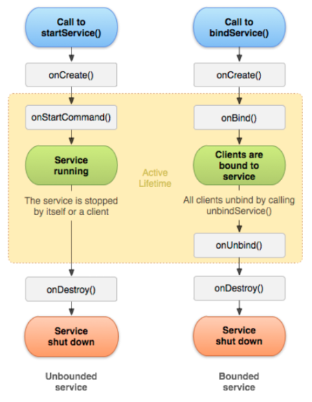

= Service

Recurso usado para operações que são executadas em segundo plano. Não oferece interface gráfica para interação com o usuário. Geralmente são indicadas
para operações longas. Um exemplo clássico de uso: uma música sendo reproduzida mesmo quando você está usando outro aplicativo.

image::https://img.youtube.com/vi/ROk-YrZKYCg/0.jpg[width=640, height=480, link="https://www.youtube.com/watch?v=ROk-YrZKYCg"]

A figura 1 mostra o ciclo de vida do service

- Referência da figura 1: GOOGLE DEVELOPERS. Visão geral dos serviços. Disponível em: https://developer.android.com/guide/components/services. Acesso: 28 ago. 2025.

Exemplo 01 (music service):

- No arquivo AndroidManifest.xml acrescente as tags:
    <uses-permission android:name="android.permission.FOREGROUND_SERVICE"/>
    <uses-permission android:name="android.permission.FOREGROUND_SERVICE_MEDIA_PLAYBACK"/>
    <uses-permission android:name="android.permission.POST_NOTIFICATIONS"/>

    <service
            android:name=".MusicService"
            android:exported="false"
            android:enabled="true"
            android:foregroundServiceType="mediaPlayback"/>

- NotificationHelper.java
[source,java]
import android.app.Notification;
import android.app.NotificationChannel;
import android.app.NotificationManager;
import android.content.Context;
import androidx.core.app.NotificationCompat;
public class NotificationHelper {
    private static final String CHANNEL_ID = "music_channel";
    public static Notification createNotification(Context context) {
        NotificationManager manager = (NotificationManager)
                context.getSystemService(Context.NOTIFICATION_SERVICE);
        if (android.os.Build.VERSION.SDK_INT >= android.os.Build.VERSION_CODES.O) {
            NotificationChannel channel = new NotificationChannel(
                    CHANNEL_ID,
                    "Music Service",
                    NotificationManager.IMPORTANCE_LOW
            );
            manager.createNotificationChannel(channel);
        }
        return new NotificationCompat.Builder(context, CHANNEL_ID)
                .setContentTitle("Reproduzindo música")
                .setContentText("A música está tocando em segundo plano")
                .setSmallIcon(android.R.drawable.ic_media_play)
                .setOngoing(true) 
                .build();
    }
}

- MusicService.java
[source,java]
import android.app.Notification;
import android.app.Service;
import android.content.Intent;
import android.media.MediaPlayer;
import android.os.Build;
import android.os.IBinder;
import android.util.Log;
import androidx.annotation.Nullable;
public class MusicService extends Service {
    private MediaPlayer mediaPlayer;
    private final String TAG = MusicService.class.getName();
    @Override
    public void onCreate() {
        super.onCreate();
        mediaPlayer = MediaPlayer.create(this, R.raw.musica);
        mediaPlayer.setLooping(true);
    }
    @Override
    public int onStartCommand(Intent intent, int flags, int startId) {
        Notification notification = NotificationHelper.createNotification(this);
        startForeground(1, notification);
        if (!mediaPlayer.isPlaying()) {
            mediaPlayer.start();
        }
        return START_STICKY;
    }
    @Override
    public void onDestroy() {
        super.onDestroy();
        Log.d(TAG, "onDestroy chamado - parando música");
        if (mediaPlayer != null) {
            if (mediaPlayer.isPlaying()) {
                mediaPlayer.stop();
            }
            mediaPlayer.reset();
            mediaPlayer.release();
            mediaPlayer = null;
            Log.d(TAG, "MediaPlayer liberado");
        }
        if (Build.VERSION.SDK_INT >= Build.VERSION_CODES.UPSIDE_DOWN_CAKE) {
            stopForeground(STOP_FOREGROUND_REMOVE);
        } else {
            stopForeground(true);
        }
    }
    @Nullable
    @Override
    public IBinder onBind(Intent intent) {
        return null;
    }
}

- activity_main.xml
[source,java]
<?xml version="1.0" encoding="utf-8"?>
<LinearLayout xmlns:android="http://schemas.android.com/apk/res/android"
    android:orientation="vertical"
    android:gravity="center"
    android:layout_width="match_parent"
    android:layout_height="match_parent"
    android:padding="24dp">
    <Button
        android:id="@+id/btnStart"
        android:layout_width="wrap_content"
        android:layout_height="wrap_content"
        android:text="Iniciar Música"/>
    <Button
        android:id="@+id/btnStop"
        android:layout_width="wrap_content"
        android:layout_height="wrap_content"
        android:text="Parar Música"
        android:layout_marginTop="16dp"/>
</LinearLayout>

- MainActivity.java
[source,java]
import android.Manifest;
import android.content.Intent;
import android.content.pm.PackageManager;
import android.os.Build;
import android.os.Bundle;
import android.widget.Toast;
import androidx.annotation.NonNull;
import androidx.appcompat.app.AppCompatActivity;
import androidx.core.app.ActivityCompat;
import com.example.musicaservice.databinding.ActivityMainBinding;
public class MainActivity extends AppCompatActivity implements PermissionRationaleDialog.PermissionRationaleListener {
    private ActivityMainBinding binding;
    private static final int REQUEST_CODE_NOTIFICATIONS = 100;
    @Override
    protected void onCreate(Bundle savedInstanceState) {
        super.onCreate(savedInstanceState);
        binding = ActivityMainBinding.inflate(getLayoutInflater());
        setContentView(binding.getRoot());
        binding.btnStart.setOnClickListener(v -> verificarPermissaoEIniciar());
        binding.btnStop.setOnClickListener(v -> stopService(new Intent(this, MusicService.class)));
    }
    private void verificarPermissaoEIniciar() {
        // Android 13 (API 33+) exige permissão de notificação em tempo de execução
        if (Build.VERSION.SDK_INT >= Build.VERSION_CODES.TIRAMISU) {
            if (ActivityCompat.checkSelfPermission(this, Manifest.permission.POST_NOTIFICATIONS) 
                    != PackageManager.PERMISSION_GRANTED) {
                    solicitarPermissao();
                }           
            }else{
                 iniciarServicoMusica();
            }
        }      
    }
    private void solicitarPermissao() {
        if (Build.VERSION.SDK_INT >= Build.VERSION_CODES.TIRAMISU) {
            ActivityCompat.requestPermissions(this, 
                    new String[]{Manifest.permission.POST_NOTIFICATIONS}, 
                    REQUEST_CODE_NOTIFICATIONS);
        }
    }
    private void iniciarServicoMusica() {
        startService(new Intent(this, MusicService.class));
        Toast.makeText(this, "Serviço de música iniciado!", Toast.LENGTH_SHORT).show();
    }

    @Override
    public void onRequestPermissionsResult(int requestCode, @NonNull String[] permissions, @NonNull int[] grantResults) {
        super.onRequestPermissionsResult(requestCode, permissions, grantResults);
        if (requestCode == REQUEST_CODE_NOTIFICATIONS) {
            if (grantResults.length > 0 && grantResults[0] == PackageManager.PERMISSION_GRANTED) {
                // Permissão concedida
                iniciarServicoMusica();
            } else {
                if (ActivityCompat.shouldShowRequestPermissionRationale(this, Manifest.permission.POST_NOTIFICATIONS)) {
                    new PermissionRationaleDialog().show(getSupportFragmentManager(), "RationaleDialog");
                } else {
                    // Negado permanentemente
                    Toast.makeText(this, "Permissão negada permanentemente. Ative nas configurações.", Toast.LENGTH_LONG).show();
                }
            }
        }
    }
}

- PermissionRationaleDialog.java
[source,java]
import android.app.AlertDialog;
import android.app.Dialog;
import android.content.Context;
import android.os.Bundle;
import androidx.annotation.NonNull;
import androidx.fragment.app.DialogFragment;
public class PermissionRationaleDialog extends DialogFragment {
    public interface PermissionRationaleListener {
        void onOkClicked();
    }
    private PermissionRationaleListener listener;
    @Override
    public void onAttach(@NonNull Context context) {
        super.onAttach(context);
        if (context instanceof PermissionRationaleListener) {
            listener = (PermissionRationaleListener) context;
        }
    }
    @NonNull
    @Override
    public Dialog onCreateDialog(Bundle savedInstanceState) {
        return new AlertDialog.Builder(requireContext())
                .setTitle("Permissão Necessária")
                .setMessage("O serviço de música precisa mostrar notificações para controlar a reprodução em segundo plano. Por favor, permita.")
                .setPositiveButton("OK", (dialog, which) -> {
                    if (listener != null) listener.onOkClicked();
                })
                .setNegativeButton("Cancelar", null)
                .create();
    }
}

- PermissionRationaleDialog.kt
[source,kotlin]
import android.app.AlertDialog
import android.app.Dialog
import android.content.Context
import android.os.Bundle
import androidx.fragment.app.DialogFragment
class PermissionRationaleDialog : DialogFragment() {
    interface PermissionRationaleListener {
        fun onOkClicked()
    }
    private var listener: PermissionRationaleListener? = null
    override fun onAttach(context: Context) {
        super.onAttach(context)
        if (context is PermissionRationaleListener) {
            listener = context
        }
    }
    override fun onCreateDialog(savedInstanceState: Bundle?): Dialog {
        return AlertDialog.Builder(requireContext())
            .setTitle("Permissão Necessária")
            .setMessage("O serviço de música precisa mostrar notificações para controlar a reprodução em segundo plano. Por favor, permita.")
            .setPositiveButton("OK") { _, _ -> listener?.onOkClicked() }
            .setNegativeButton("Cancelar", null)
            .create()
    }
}

- MainActivity.kt
[source,kotlin]
import android.Manifest
import android.content.Intent
import android.content.pm.PackageManager
import android.os.Build
import android.os.Bundle
import android.widget.Toast
import androidx.appcompat.app.AppCompatActivity
import androidx.core.app.ActivityCompat
import com.example.musicaservice.databinding.ActivityMainBinding
class MainActivity : AppCompatActivity(), PermissionRationaleDialog.PermissionRationaleListener {
    private lateinit var binding: ActivityMainBinding
    private val requestCodeNotifications = 100
    override fun onCreate(savedInstanceState: Bundle?) {
        super.onCreate(savedInstanceState)
        binding = ActivityMainBinding.inflate(layoutInflater)
        setContentView(binding.root)
        binding.btnStart.setOnClickListener { verificarPermissaoEIniciar() }
        binding.btnStop.setOnClickListener { stopService(Intent(this, MusicService::class.java)) }
    }
    private fun verificarPermissaoEIniciar() {
        if (Build.VERSION.SDK_INT >= Build.VERSION_CODES.TIRAMISU) {
            if (ActivityCompat.checkSelfPermission(this, Manifest.permission.POST_NOTIFICATIONS) 
                != PackageManager.PERMISSION_GRANTED) {
                 solicitarPermissao()
            }else{
                 iniciarServicoMusica()
            }
        }
    }
    private fun solicitarPermissao() {
        if (Build.VERSION.SDK_INT >= Build.VERSION_CODES.TIRAMISU) {
            ActivityCompat.requestPermissions(
                this,
                arrayOf(Manifest.permission.POST_NOTIFICATIONS),
                requestCodeNotifications
            )
        }
    }
    private fun iniciarServicoMusica() {
        startService(Intent(this, MusicService::class.java))
        Toast.makeText(this, "Serviço de música iniciado!", Toast.LENGTH_SHORT).show()
    }
    override fun onRequestPermissionsResult(requestCode: Int, permissions: Array<out String>, grantResults: IntArray) {
        super.onRequestPermissionsResult(requestCode, permissions, grantResults)
        if (requestCode == requestCodeNotifications) {
            if (grantResults.isNotEmpty() && grantResults[0] == PackageManager.PERMISSION_GRANTED) {
                iniciarServicoMusica()
            } else {
                if (ActivityCompat.shouldShowRequestPermissionRationale(this, Manifest.permission.POST_NOTIFICATIONS)) {
                    PermissionRationaleDialog().show(supportFragmentManager, "RationaleDialog")
                } else {
                    Toast.makeText(this, "Permissão negada permanentemente. Ative nas configurações.", Toast.LENGTH_LONG).show()
                }
            }
        }
    }
}

- MusicService.kt
[source,kotlin]
import android.app.Service
import android.content.Intent
import android.media.MediaPlayer
import android.os.Build
import android.os.IBinder
import android.util.Log
class MusicService : Service() {
    private var mediaPlayer: MediaPlayer? = null
    private val tag = MusicService::class.java.name
    override fun onCreate() {
        super.onCreate()
        mediaPlayer = MediaPlayer.create(this, R.raw.musica)
        mediaPlayer?.isLooping = true
    }
    override fun onStartCommand(intent: Intent?, flags: Int, startId: Int): Int {
        val notification = NotificationHelper.createNotification(this)
        startForeground(1, notification)
        mediaPlayer?.let {
            if (!it.isPlaying) it.start()
        }
        return START_STICKY
    }
    override fun onDestroy() {
        super.onDestroy()
        Log.d(tag, "onDestroy chamado - parando música")
        mediaPlayer?.let {
            if (it.isPlaying) it.stop()
            it.reset()
            it.release()
        }
        mediaPlayer = null
        Log.d(tag, "MediaPlayer liberado")
        if (Build.VERSION.SDK_INT >= Build.VERSION_CODES.UPSIDE_DOWN_CAKE) {
            stopForeground(STOP_FOREGROUND_REMOVE)
        } else {
            stopForeground(true)
        }
    }
    override fun onBind(intent: Intent?): IBinder? = null
}

- NotificationHelper.kt
[source,kotlin]
import android.app.Notification
import android.app.NotificationChannel
import android.app.NotificationManager
import android.content.Context
import android.os.Build
import androidx.core.app.NotificationCompat
object NotificationHelper {
    private const val CHANNEL_ID = "music_channel"
    fun createNotification(context: Context): Notification {
        val manager = context.getSystemService(Context.NOTIFICATION_SERVICE) as NotificationManager
        if (Build.VERSION.SDK_INT >= Build.VERSION_CODES.O) {
            val channel = NotificationChannel(
                CHANNEL_ID,
                "Music Service",
                NotificationManager.IMPORTANCE_LOW
            )
            manager.createNotificationChannel(channel)
        }
        return NotificationCompat.Builder(context, CHANNEL_ID)
            .setContentTitle("Reproduzindo música")
            .setContentText("A música está tocando em segundo plano")
            .setSmallIcon(android.R.drawable.ic_media_play)
            .setOngoing(true)
            .build()
    }
}
