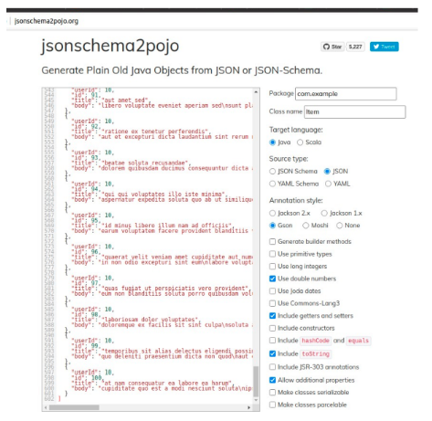

//caminho padrão para imagens

:figure-caption: Figura
:doctype: book

//gera apresentacao
//pode se baixar os arquivos e add no diretório
:revealjsdir: https://cdnjs.cloudflare.com/ajax/libs/reveal.js/3.8.0

//GERAR ARQUIVOS
//make slides
//make ebook

== Web Service

Web Service pode ser definida como um recurso no qual permite as comunicações entre os programas (que podem ser de plataformas diferentes) geralmente acontecem através do protocolo HTTP.

"Um serviço da Web é um sistema de software projetado para oferecer suporte à interação máquina a máquina interoperável em uma rede. Possui uma interface descrita em um formato processável por máquina (especificamente WSDL). Outros sistemas interagem com o serviço da Web de uma maneira prescrita por sua descrição usando mensagens SOAP, normalmente transmitidas usando HTTP com uma serialização XML em conjunto com outros padrões relacionados à Web (WORLD WIDE WEB)."

- Referência do texto entre aspas: WORLD WIDE WEB (W3C). Arquitetura de serviços da Web. Disponível em: https://www.w3.org/TR/ws-arch/#whatis. Acesso em: 21 de ago. 2025.

== Esquematização

A figura 1 mostra uma esquematização das interações entre os componentes. Observe que as aplicações clientes se comunicam com a parte servidora através das APIs (camadas de interfaces). Dessa forma, estas partes se comunicam sem saber os detalhes de implementação de cada uma.

Figura 1

image::api.png[]

- Referência da figura 1: RED HAT. O que é uma API? Disponível em: https://www.redhat.com/pt-br/topics/api/what-are-application-programming-interfaces. Acesso em: 21 de ago. 2025.

Mais detalhes sobre WebService: POLO, Gabriel. O que é um web service? Disponível em: https://gabrielpolo.medium.com/o-que-%C3%A9-um-webservice-c5104d847a85. Acesso em: 21 de ago. 2025.

Diferenças entre Aplicação Web e Web Services: uma aplicação web é um programa acessado por meio de um navegador usando o protocolo HTTP/HTTPS. É criado para interação direta com o usuário. Geralmente oferece uma interface gráfica (UI) renderizada em HTML, CSS e JavaScript. Exemplo: o site do IFTO. Já Web Services é uma tecnologia que permite a comunicação entre sistemas (máquina - máquina). Exemplo quando o aplicativo no seu celular acessa a API da GoogleMaps.

= Diferenças Fundamentais

[cols="1,2,2", options="header"]
|===
| *Aspecto*             | *Aplicação Web*                          | *Web Service*
| *Destinatários*       | Usuários humanos                         | Outros sistemas ou aplicações
| *Interface*           | Interface gráfica (HTML, CSS, JS)        | Interface de programação (API, XML, JSON)
| *Propósito*           | Oferecer uma experiência interativa      | Fornecer dados ou serviços para integração
| *Exemplo de Uso*      | Site de reservas de hotel                | API para consultar disponibilidade de quartos
| *Protocolos/Modelos*  | HTTP/HTTPS                               | HTTP/HTTPS, SOAP, REST, etc.
| *Formato de Resposta* | Páginas web (HTML)                       | Dados estruturados (JSON, XML)
|===

HTTP -> Protocolo -> Transportar as mensagens
JSON -> Formato-> Representar os dados
REST -> Arquitetura-> Organizar as regras de comunicação usando HTTP

Exemplo de Web Service usando o modelo de design REST

Endpoint (URL) do serviço para obter a lista de alunos: https://api.exemplo.com/alunos

- Solicitação GET https://api.exemplo.com/alunos

A resposta pode ser um arquivo JSON representando os dados dos alunos
[source,xml]
[
    {
        "id": 1,
        "aluno": "Ana Paula"
    },
    {
        "id": 2,
        "aluno": "Rodrigo André
    }
]

== Consumo / Envio de Dados: Arquivos JSON

Através do WebService é possível a troca de mensagens entre aplicações, o formato JSON permite uma comunicação mais leve do que a formatação XML. O JSON usa apenas textos podendo representar um objeto ou uma coleção de objetos. 

Exemplo de objeto no JSON
[source,xml]
{
	nome: "Paulo,
	curso: "Sistema para Internet",
	idade: 33
}

Exemplo de vetores no JSON
[source,xml]
[
{
	nome: "Paulo,
	curso: "Sistema para Internet",
	idade: 33
},
{
	nome: "Paula,
	curso: "Informática",
	idade: 35
},
{
	nome: "Ana,
	curso: "Agronomia",
	idade: 25
}
]

Mais detalhes sobre JSON: JSON org. Introdução ao JSON. Disponível em: https://www.json.org/json-pt.html. Acesso em: 21 de ago. 2025.

Exemplos práticos

Consumo/envio JSON sem biblioteca (exemplo um)

- activity_main.xml
[source,xml]
<?xml version="1.0" encoding="utf-8"?>
<LinearLayout xmlns:android="http://schemas.android.com/apk/res/android"
    xmlns:tools="http://schemas.android.com/tools"
    android:layout_width="match_parent"
    android:layout_height="match_parent"
    android:layout_margin="10dp"
    android:orientation="vertical"
    android:padding="10dp"
    tools:context=".MainActivity">
    <EditText
        android:id="@+id/editTextNome"
        android:layout_width="match_parent"
        android:layout_height="wrap_content"
        android:hint="Digite seu Nome" />
    <EditText
        android:id="@+id/editTextDisciplina"
        android:layout_width="match_parent"
        android:layout_height="wrap_content"
        android:hint="Digite o nome da Disciplina" />
    <EditText
        android:id="@+id/editTextNota"
        android:layout_width="match_parent"
        android:layout_height="wrap_content"
        android:hint="Digite a Nota"
        android:inputType="number" />
    <LinearLayout
        android:layout_width="match_parent"
        android:layout_height="wrap_content"
        android:orientation="horizontal">
        <Button
            android:id="@+id/buttonAdicionar"
            android:layout_width="0dp"
            android:layout_height="wrap_content"
            android:onClick="criarLista"
            android:layout_weight="1"
            android:text="A" />
        <Button
            android:id="@+id/buttonGerar"
            android:layout_width="0dp"
            android:layout_height="wrap_content"
            android:onClick="gerarJson"
            android:layout_weight="1"
            android:text="G" />
        <Button
            android:id="@+id/buttonConsumir"
            android:layout_width="0dp"
            android:layout_height="wrap_content"
            android:onClick="abrirTela"
            android:layout_weight="1"
            android:text="C" />
    </LinearLayout>
    <TextView
        android:id="@+id/textViewResultado"
        android:layout_width="wrap_content"
        android:layout_height="wrap_content"
        android:text="Resultado" />
</LinearLayout>

- activity_segunda.xml
[source,xml]
<?xml version="1.0" encoding="utf-8"?>
<LinearLayout xmlns:android="http://schemas.android.com/apk/res/android"
    android:layout_width="match_parent"
    android:layout_height="match_parent"
    android:layout_margin="10dp"
    android:orientation="vertical"
    android:padding="10dp">
    <ListView
        android:id="@+id/listViewDados"
        android:layout_width="match_parent"
        android:layout_height="match_parent" />
</LinearLayout>

- Estudante.java
[source,java]
public class Estudante {
    private  String nome,disciplina;
    private  int nota;
    public Estudante(String nome, String disciplina, int nota) {
        this.nome = nome;
        this.disciplina = disciplina;
        this.nota = nota;
    }
    public Estudante() {
    }
    public String getNome() {
        return nome;
    }
    public void setNome(String nome) {
        this.nome = nome;
    }
    public String getDisciplina() {
        return disciplina;
    }
    public void setDisciplina(String disciplina) {
        this.disciplina = disciplina;
    }
    public int getNota() {
        return nota;
    }
    public void setNota(int nota) {
        this.nota = nota;
    }
    @Override
    public String toString() {
        return "Estudante{" +
                "nome='" + nome + '\'' +
                '}';
    }
}

- MainActivity.java
[source,java]
import android.content.Intent;
import android.os.Bundle;
import android.view.View;
import android.widget.EditText;
import android.widget.TextView;
import android.widget.Toast;
import androidx.appcompat.app.AppCompatActivity;
import org.json.JSONArray;
import org.json.JSONException;
import org.json.JSONObject;
import java.util.ArrayList;
import java.util.List;
public class MainActivity extends AppCompatActivity {
    private EditText editTextNome, editTextDisciplina, editTextNota;
    private List<Estudante> lista;
    private TextView textViewResultado;
    private String retorno;
    @Override
    protected void onCreate(Bundle savedInstanceState) {
        super.onCreate(savedInstanceState);
        setContentView(R.layout.activity_main);
        editTextNome = findViewById(R.id.editTextNome);
        editTextDisciplina = findViewById(R.id.editTextDisciplina);
        editTextNota = findViewById(R.id.editTextNota);
        textViewResultado = findViewById(R.id.textViewResultado);
        lista = new ArrayList<>();
    }
    public void criarLista(View v) {
        try {
            int nota = Integer.parseInt(editTextNota.getText().toString());
            lista.add(new Estudante(
                    editTextNome.getText().toString(),
                    editTextDisciplina.getText().toString(),
                    nota
            ));
            Toast.makeText(getApplicationContext(), "Item inserido", Toast.LENGTH_SHORT).show();
        } catch (NumberFormatException e) {
            Toast.makeText(getApplicationContext(), "Digite uma nota válida", Toast.LENGTH_SHORT).show();
        }
    }
    public String criarJson() {
        JSONArray jsonArray = new JSONArray();
        for (Estudante est : lista) {
            JSONObject jsonObject = new JSONObject();
            try {
                jsonObject.put("nomeEstudante", est.getNome());
                jsonObject.put("disciplinaEstudante", est.getDisciplina());
                jsonObject.put("notaEstudante", est.getNota());
                jsonArray.put(jsonObject);
            } catch (JSONException e) {
                e.printStackTrace();
            }
        }
        return "{\"estudantes\":" + jsonArray.toString() + "}";
    }
    public void gerarJson(View v) {
        retorno = criarJson();
        textViewResultado.setText(retorno);
    }
    public void abrirTela(View v) {
        if (retorno == null || retorno.isEmpty()) {
            Toast.makeText(this, "Nenhum dado gerado", Toast.LENGTH_SHORT).show();
            return;
        }
        Intent intent = new Intent(getApplicationContext(), SegundaActivity.class);
        intent.putExtra("dados", retorno);
        startActivity(intent);
    }
}

- SegundaActivity.java
[source,java]
import android.os.Bundle;
import android.view.View;
import android.widget.AdapterView;
import android.widget.ArrayAdapter;
import android.widget.ListView;
import androidx.appcompat.app.AlertDialog;
import androidx.appcompat.app.AppCompatActivity;
import org.json.JSONArray;
import org.json.JSONException;
import org.json.JSONObject;
import java.util.ArrayList;
import java.util.List;
public class SegundaActivity extends AppCompatActivity implements AdapterView.OnItemClickListener {
    private String dadosJSON;
    private ListView listView;
    private List<Estudante> lista;
    private ArrayAdapter<Estudante> adapter;
    @Override
    protected void onCreate(Bundle savedInstanceState) {
        super.onCreate(savedInstanceState);
        setContentView(R.layout.activity_segunda);
        dadosJSON = getIntent().getStringExtra("dados");
        listView = findViewById(R.id.listViewDados);
        lista = consumirJSON();
        adapter = new ArrayAdapter<>(this, android.R.layout.simple_list_item_1, lista);
        listView.setAdapter(adapter);
        listView.setOnItemClickListener(this);
    }
    @Override
    public void onItemClick(AdapterView<?> parent, View view, int position, long id) {
        AlertDialog alertDialog = new AlertDialog.Builder(this)
                .setTitle("Dados Estudante")
                .setMessage("Nome: " + lista.get(position).getNome()
                        + "\nDisciplina: " + lista.get(position).getDisciplina()
                        + "\nNota: " + lista.get(position).getNota())
                .setPositiveButton("OK", null)
                .create();
        alertDialog.show();
    }
    private List<Estudante> consumirJSON() {
        List<Estudante> listaEstudantes = new ArrayList<>();
        try {
            JSONObject jsonObject = new JSONObject(dadosJSON);
            JSONArray jsonArray = jsonObject.getJSONArray("estudantes");
            for (int i = 0; i < jsonArray.length(); i++) {
                JSONObject object = jsonArray.getJSONObject(i);
                Estudante estudante = new Estudante();
                estudante.setNome(object.getString("nomeEstudante"));
                estudante.setDisciplina(object.getString("disciplinaEstudante"));
                estudante.setNota(object.getInt("notaEstudante"));
                listaEstudantes.add(estudante);
            }
        } catch (JSONException e) {
            e.printStackTrace();
        }
        return listaEstudantes;
    }
}

No exemplo anterior foi usado o JSON de forma nativa. Existe uma opção mais fácil para criar e consumir o arquivo usando outras bibliotecas. Veja o exemplo do mesmo projeto, porém usando a biblioteca Gson.

Consumo/envio JSON com biblioteca (exemplo dois)

Inicialmente deve-se adicionar a biblioteca GSON no projeto, portanto, no arquivo Gradle na área de dependências, adicione a linha: implementation("com.google.code.gson:gson:2.11.0")

- Estudante.java
[source,java]
public class Estudante {
    private String nome;
    private String disciplina;
    private int nota;
    public Estudante(String nome, String disciplina, int nota) {
        this.nome = nome;
        this.disciplina = disciplina;
        this.nota = nota;
    }
    public Estudante() {}
    public String getNome() {
        return nome;
    }
    public void setNome(String nome) {
        this.nome = nome;
    }
    public String getDisciplina() {
        return disciplina;
    }
    public void setDisciplina(String disciplina) {
        this.disciplina = disciplina;
    }
    public int getNota() {
        return nota;
    }
    public void setNota(int nota) {
        this.nota = nota;
    }
    @Override
    public String toString() {
        return nome + " - " + disciplina + " (" + nota + ")";
    }
}

- activity_main.xml
[source,xml]
<?xml version="1.0" encoding="utf-8"?>
<LinearLayout xmlns:android="http://schemas.android.com/apk/res/android"
    android:layout_width="match_parent"
    android:layout_height="match_parent"
    android:orientation="vertical"
    android:padding="16dp">
    <EditText
        android:id="@+id/editTextNome"
        android:layout_width="match_parent"
        android:layout_height="wrap_content"
        android:hint="Digite seu Nome" />
    <EditText
        android:id="@+id/editTextDisciplina"
        android:layout_width="match_parent"
        android:layout_height="wrap_content"
        android:hint="Digite a Disciplina" />
    <EditText
        android:id="@+id/editTextNota"
        android:layout_width="match_parent"
        android:layout_height="wrap_content"
        android:hint="Digite a Nota"
        android:inputType="number" />
    <LinearLayout
        android:layout_width="match_parent"
        android:layout_height="wrap_content"
        android:orientation="horizontal"
        android:layout_marginTop="12dp">
        <Button
            android:id="@+id/buttonAdd"
            android:layout_width="0dp"
            android:layout_height="wrap_content"
            android:layout_weight="1"
            android:onClick="criarLista"
            android:text="Adicionar" />
        <Button
            android:id="@+id/buttonGerar"
            android:layout_width="0dp"
            android:layout_height="wrap_content"
            android:layout_weight="1"
            android:onClick="gerarJSON"
            android:text="Gerar JSON" />
        <Button
            android:id="@+id/buttonConsumir"
            android:layout_width="0dp"
            android:layout_height="wrap_content"
            android:layout_weight="1"
            android:onClick="abrirTela"
            android:text="Consumir" />
    </LinearLayout>
    <TextView
        android:id="@+id/textViewResultado"
        android:layout_width="match_parent"
        android:layout_height="wrap_content"
        android:text="Resultado aparecerá aqui"
        android:layout_marginTop="12dp" />
</LinearLayout>

- activity_segunda.xml
[source,xml]
<?xml version="1.0" encoding="utf-8"?>
<LinearLayout xmlns:android="http://schemas.android.com/apk/res/android"
    android:layout_width="match_parent"
    android:layout_height="match_parent"
    android:orientation="vertical"
    android:padding="16dp">
    <ListView
        android:id="@+id/listViewDados"
        android:layout_width="match_parent"
        android:layout_height="match_parent" />
</LinearLayout>

- MainActivity.java
[source,java]
import android.os.Bundle;
import androidx.activity.EdgeToEdge;
import androidx.appcompat.app.AppCompatActivity;
import androidx.core.graphics.Insets;
import androidx.core.view.ViewCompat;
import androidx.core.view.WindowInsetsCompat;
import androidx.appcompat.app.AppCompatActivity;
import android.content.Intent;
import android.os.Bundle;
import android.view.View;
import android.widget.EditText;
import android.widget.TextView;
import android.widget.Toast;
import com.google.gson.Gson;
import java.util.ArrayList;
import java.util.List;
public class MainActivity extends AppCompatActivity {
    private EditText editTextNome, editTextDisciplina, editTextNota;
    private TextView textViewResultado;
    private List<Estudante> lista;
    private String retorno;
    @Override
    protected void onCreate(Bundle savedInstanceState) {
        super.onCreate(savedInstanceState);
        setContentView(R.layout.activity_main);
        editTextNome = findViewById(R.id.editTextNome);
        editTextDisciplina = findViewById(R.id.editTextDisciplina);
        editTextNota = findViewById(R.id.editTextNota);
        textViewResultado = findViewById(R.id.textViewResultado);
        lista = new ArrayList<>();
    }
    public void criarLista(View v) {
        try {
            int nota = Integer.parseInt(editTextNota.getText().toString());
            lista.add(new Estudante(
                    editTextNome.getText().toString(),
                    editTextDisciplina.getText().toString(),
                    nota
            ));
            Toast.makeText(getApplicationContext(), "Item inserido", Toast.LENGTH_SHORT).show();
        } catch (NumberFormatException e) {
            Toast.makeText(getApplicationContext(), "Digite uma nota válida", Toast.LENGTH_SHORT).show();
        }
    }
    public String criarJSON(List<Estudante> dados) {
        Gson gson = new Gson();
        return gson.toJson(dados); 
    }
    public void gerarJSON(View v) {
        retorno = criarJSON(lista);
        textViewResultado.setText(retorno);
    }
    public void abrirTela(View v) {
        if (retorno == null || retorno.isEmpty()) {
            Toast.makeText(this, "Nenhum dado gerado", Toast.LENGTH_SHORT).show();
            return;
        }
        Intent it = new Intent(getApplicationContext(), SegundaActivity.class);
        it.putExtra("dados", retorno);
        startActivity(it);
    }
}

- SegundaActivity.java
[source,java]
import android.os.Bundle;
import androidx.activity.EdgeToEdge;
import androidx.appcompat.app.AppCompatActivity;
import androidx.core.graphics.Insets;
import androidx.core.view.ViewCompat;
import androidx.core.view.WindowInsetsCompat;
import androidx.appcompat.app.AppCompatActivity;
import android.os.Bundle;
import android.widget.ArrayAdapter;
import android.widget.ListView;
import android.widget.Toast;
import com.google.gson.Gson;
import com.google.gson.reflect.TypeToken;
import java.lang.reflect.Type;
import java.util.List;
public class SegundaActivity extends AppCompatActivity {
    private String dadosJSON;
    private ListView listView;
    private List<Estudante> lista;
    private ArrayAdapter<Estudante> adapter;
    @Override
    protected void onCreate(Bundle savedInstanceState) {
        super.onCreate(savedInstanceState);
        setContentView(R.layout.activity_segunda);
        dadosJSON = getIntent().getStringExtra("dados");
        listView = findViewById(R.id.listViewDados);
        lista = consumirJSON();
        if (lista != null) {
            adapter = new ArrayAdapter<>(this, android.R.layout.simple_list_item_1, lista);
            listView.setAdapter(adapter);
        }
    }
    private List<Estudante> consumirJSON() {
        if (dadosJSON != null) {
            Gson gson = new Gson();
            Type type = new TypeToken<List<Estudante>>() {}.getType();
            List<Estudante> listaEstudantes = gson.fromJson(dadosJSON, type);
            Toast.makeText(getApplicationContext(), "Carregado: " + listaEstudantes.size() + " itens", Toast.LENGTH_SHORT).show();
            return listaEstudantes;
        }
        return null;
    }
}

Classe TypenToken: classe genérica presente na lib GSON que possibilita obter um tipo de dado em tempo de execução e recuperá-lo. Para mais detalhes da classe acesse a documentação do Java, disponível em: https://www.javadoc.io/doc/com.google.code.gson/gson/2.6.2/com/google/gson/reflect/TypeToken.html.

== Exemplos práticos (Consumo/envio JSON com biblioteca remotamente) 

Inicialmente cria-se um novo projeto no Android Studio. No arquivo build.gradle (Module:app) deve ser adicionado a linha implementation ‘com.google.code.gson:gson:2.11.0'. No arquivo AndroidManifest.xml deve ser adicionado a linha <uses-permission android:name="android.permission.INTERNET"/>.

Neste exemplo, será consumido o JSON retornado da seguinte URL: https://jsonplaceholder.typicode.com/posts/. Antes de implementar a classe MainActivity, primeiro será criado a classe POJO derivada do arquivo JSON. Neste material será usado a biblioteca criada por joelittlejohn, disponível em: http://www.jsonschema2pojo.org/. Esse site permite fazer a conversão de JSON para classe POJO para ser usada com a biblioteca GSON. A figura 1 mostra o site.

- Para saber mais detalhes sobre as anotações @Expose e @SerializedName, acesse o link do site Stack Overflow: https://stackoverflow.com/questions/34752200/gson-expose-vs-serializedname. Pergunta realizada pelo usuário <https://stackoverflow.com/users/867591/ahmed-faisal> em 12 de jan. 2016 e respondida pelo usuário <https://stackoverflow.com/users/8942811/bek> em 7 de set. 2018.  Acesso em: 21 de ago. 2025.

Após a criação da class POJO, pode-se dar continuidade no projeto. Os códigos estão disponibilizados a seguir:

No arquivo AndroidManifest.xml adicione <uses-permission android:name="android.permission.INTERNET" />

- Conversao.java
[source,java]
import java.io.BufferedReader;
import java.io.IOException;
import java.io.InputStream;
import java.io.InputStreamReader;
public class Conversao {
    public String converter(InputStream inputStream) {
        if (inputStream == null) return null;
        InputStreamReader inputStreamReader = new InputStreamReader(inputStream);
        BufferedReader bufferedReader = new BufferedReader(inputStreamReader);
        StringBuilder stringBuilder = new StringBuilder();
        String conteudo;
        try {
            while ((conteudo = bufferedReader.readLine()) != null) {
                stringBuilder.append(conteudo).append("\n");
            }
        } catch (IOException e) {
            e.printStackTrace();
        }
        return stringBuilder.toString();
    }
}

- Conexao.java
[source,java]
import java.io.BufferedInputStream;
import java.io.IOException;
import java.io.InputStream;
import java.net.HttpURLConnection;
import java.net.URL;
public class Conexao {
    public InputStream obterRespostaHTTP(String end) {
        try {
            URL url = new URL(end);
            HttpURLConnection conexao = (HttpURLConnection) url.openConnection();
            conexao.setRequestMethod("GET");
            conexao.connect();
            return new BufferedInputStream(conexao.getInputStream());
        } catch (IOException e) {
            e.printStackTrace();
        }
        return null;
    }
}

- Item.java
[source,java]
import com.google.gson.annotations.Expose;
import com.google.gson.annotations.SerializedName;
public class Item {
    @SerializedName("userId")
    @Expose
    private Integer userId;
    @SerializedName("id")
    @Expose
    private Integer id;
    @SerializedName("title")
    @Expose
    private String title;
    @SerializedName("body")
    @Expose
    private String body;
    public Integer getUserId() { return userId; }
    public void setUserId(Integer userId) { this.userId = userId; }
    public Integer getId() { return id; }
    public void setId(Integer id) { this.id = id; }
    public String getTitle() { return title; }
    public void setTitle(String title) { this.title = title; }
    public String getBody() { return body; }
    public void setBody(String body) { this.body = body; }
    @Override
    public String toString() {
        return "Item{" +
                "userId=" + userId +
                ", id=" + id +
                ", title='" + title + '\'' +
                ", body='" + body + '\'' +
                '}';
    }
}

- activity_main.xml
[source,xml]
<LinearLayout xmlns:android="http://schemas.android.com/apk/res/android"
    xmlns:app="http://schemas.android.com/apk/res-auto"
    xmlns:tools="http://schemas.android.com/tools"
    android:layout_width="match_parent"
    android:layout_height="match_parent"
    android:orientation="vertical"
    android:padding="10dp"
    tools:context=".MainActivity">
    <ListView
        android:id="@+id/listViewDados"
        android:layout_width="match_parent"
        android:layout_height="match_parent"
        android:divider="@android:color/darker_gray"
        android:dividerHeight="1dp" />
</LinearLayout>

- MainActivity.java
[source,java]
import android.os.Bundle;
import androidx.activity.EdgeToEdge;
import androidx.appcompat.app.AppCompatActivity;
import androidx.core.graphics.Insets;
import androidx.core.view.ViewCompat;
import androidx.core.view.WindowInsetsCompat;
import androidx.appcompat.app.AppCompatActivity;
import android.os.AsyncTask;
import android.os.Bundle;
import android.util.Log;
import android.widget.ArrayAdapter;
import android.widget.ListView;
import android.widget.Toast;
import com.google.gson.Gson;
import com.google.gson.reflect.TypeToken;
import java.io.InputStream;
import java.lang.reflect.Type;
import java.util.ArrayList;
import java.util.List;
public class MainActivity extends AppCompatActivity {
    private ListView listView;
    private ArrayAdapter<String> adapter;
    private List<String> listaStrings;
    private final String URL = "https://jsonplaceholder.typicode.com/posts";
    @Override
    protected void onCreate(Bundle savedInstanceState) {
        super.onCreate(savedInstanceState);
        setContentView(R.layout.activity_main);
        listView = findViewById(R.id.listViewDados);
        listaStrings = new ArrayList<>();
        adapter = new ArrayAdapter<>(this, android.R.layout.simple_list_item_1, listaStrings);
        listView.setAdapter(adapter);
        new obterDados().execute();
    }
    private class obterDados extends AsyncTask<Void, Void, List<Item>> {
        @Override
        protected void onPreExecute() {
            super.onPreExecute();
            Toast.makeText(getApplicationContext(), "Download começando...", Toast.LENGTH_SHORT).show();
        }
        @Override
        protected List<Item> doInBackground(Void... voids) {
            Conexao conexao = new Conexao();
            InputStream inputStream = conexao.obterRespostaHTTP(URL);
            Conversao Conversao = new Conversao();
            String textoJSON = Conversao.converter(inputStream);
            Log.i("JSON", "doInBackground: " + textoJSON);
            if (textoJSON != null) {
                Gson gson = new Gson();
                Type type = new TypeToken<List<Item>>() {}.getType();
                return gson.fromJson(textoJSON, type);
            }
            return null;
        }
        @Override
        protected void onPostExecute(List<Item> dadosBaixados) {
            super.onPostExecute(dadosBaixados);
            if (dadosBaixados != null) {
                listaStrings.clear();
                for (Item item : dadosBaixados) {
                    listaStrings.add("UserID: " + item.getUserId()
                            + "\nID: " + item.getId()
                            + "\nTítulo: " + item.getTitle()
                            + "\nBody: " + item.getBody());
                }
                adapter.notifyDataSetChanged();
            } else {
                Toast.makeText(getApplicationContext(), "Não foi possível obter JSON", Toast.LENGTH_SHORT).show();
            }
        }
    }
}

A classe AsyncTask foi descontinuada, segue a versão abaixo usando a classe Executor:

- AndroidManisfest.xml: <uses-permission android:name="android.permission.INTERNET"/>

- Arquivo Gradle: implementation("com.google.code.gson:gson:2.11.0")

- Versão sem VIEWMODEL

- Item.java
[source,java]
import com.google.gson.annotations.Expose;
import com.google.gson.annotations.SerializedName;
public class Item {
    @SerializedName("userId")
    @Expose
    private Integer userId;
    @SerializedName("id")
    @Expose
    private Integer id;
    @SerializedName("title")
    @Expose
    private String title;
    @SerializedName("body")
    @Expose
    private String body;
    public Integer getUserId() { return userId; }
    public void setUserId(Integer userId) { this.userId = userId; }
    public Integer getId() { return id; }
    public void setId(Integer id) { this.id = id; }
    public String getTitle() { return title; }
    public void setTitle(String title) { this.title = title; }
    public String getBody() { return body; }
    public void setBody(String body) { this.body = body; }
    @Override
    public String toString() {
        return "Item{" +
                "userId=" + userId +
                ", id=" + id +
                ", title='" + title + '\'' +
                ", body='" + body + '\'' +
                '}';
    }
}

- Conexao.java
[source,java]
import java.io.BufferedInputStream;
import java.io.IOException;
import java.io.InputStream;
import java.net.HttpURLConnection;
import java.net.URL;
public class Conexao {
    public InputStream obterRespostaHTTP(String end) {
        HttpURLConnection conexao = null;
        try {
            URL url = new URL(end);
            conexao = (HttpURLConnection) url.openConnection();
            conexao.setConnectTimeout(10000);
            conexao.setReadTimeout(20000);
            conexao.setRequestMethod("GET");
            conexao.connect();
            return new BufferedInputStream(conexao.getInputStream());
        } catch (IOException e) {
            e.printStackTrace();
        }finally {
            if (conexao != null) {
                conexao.disconnect();
            }
        }
        return null;
    }
}

- Conversao.java
[source,java]
import java.io.BufferedReader;
import java.io.IOException;
import java.io.InputStream;
import java.io.InputStreamReader;
public class Conversao {
    public String converter(InputStream inputStream) {
        if (inputStream == null) return null;
        InputStreamReader inputStreamReader = new InputStreamReader(inputStream);
        BufferedReader bufferedReader = new BufferedReader(inputStreamReader);
        StringBuilder stringBuilder = new StringBuilder();
        String conteudo;
        try {
            while ((conteudo = bufferedReader.readLine()) != null) {
                stringBuilder.append(conteudo).append("\n");
            }
        } catch (IOException e) {
            e.printStackTrace();
        }
        return stringBuilder.toString();
    }
}

- Repositorio.java
[source,java]
import android.os.Handler;
import android.os.Looper;
import android.util.Log;
import com.google.gson.Gson;
import com.google.gson.reflect.TypeToken;
import java.io.InputStream;
import java.lang.reflect.Type;
import java.util.ArrayList;
import java.util.List;
import java.util.concurrent.ExecutorService;
import java.util.concurrent.Executors;
public class Repositorio {
    private static final String URL = "https://jsonplaceholder.typicode.com/posts";
    private ExecutorService executor;
    private Handler mainHandler;
    public Repositorio() {
        this.executor = Executors.newSingleThreadExecutor();
        this.mainHandler = new Handler(Looper.getMainLooper());
    }
    public interface Callback{
        void sucesso(List<String> items);
        void erro(String mensagem);
    }//
    private void sucesso(Callback c, List<String> itens){
        mainHandler.post(new Runnable() {
            @Override
            public void run() {
                c.sucesso(itens);
            }
        });
    }//
    private void erro(Callback c, String mensagem){
        mainHandler.post(new Runnable() {
            @Override
            public void run() {
                c.erro(mensagem);
            }
        });
    }//
    public void obterDados(Callback c){
        executor.execute(new Runnable() {
            @Override
            public void run() {
                try {
                    Conexao conexao = new Conexao();
                    InputStream inputStream = conexao.obterRespostaHTTP(URL);
                    Conversao conversao = new Conversao();
                    String jsonString = conversao.converter(inputStream);
                    if (jsonString == null || jsonString.isEmpty()) {
                        erro(c, "Resposta vazia");
                        return;
                    }
                    Log.i("JSON", "Recebido: " + jsonString);
                    Gson gson = new Gson();
                    Type type = new TypeToken<List<Item>>() {}.getType();
                    List<Item> dados = gson.fromJson(jsonString, type);
                    List<String> itens = new ArrayList<>();
                    for (Item i:dados) {
                        itens.add(i.toString());
                    }
                    sucesso(c, itens);
                } catch (Exception e) {
                    e.printStackTrace();
                    erro(c,"erro ao baixar: "+e.getMessage());
                }
            }
        });
    }//
}//class

- activity_main.xml
[source,xml]
<LinearLayout xmlns:android="http://schemas.android.com/apk/res/android"
    xmlns:app="http://schemas.android.com/apk/res-auto"
    xmlns:tools="http://schemas.android.com/tools"
    android:layout_width="match_parent"
    android:layout_height="match_parent"
    android:orientation="vertical"
    android:padding="10dp"
    tools:context=".MainActivity">
    <ListView
        android:id="@+id/listViewDados"
        android:layout_width="match_parent"
        android:layout_height="match_parent"
        android:divider="@android:color/darker_gray"
        android:dividerHeight="1dp" />
</LinearLayout>

- MainActivity.java
[source,java]
import androidx.appcompat.app.AppCompatActivity;
import android.os.Bundle;
import android.widget.ArrayAdapter;
import android.widget.ListView;
import android.widget.Toast;
import java.util.ArrayList;
import java.util.List;
public class MainActivity extends AppCompatActivity{
        private ListView listView;
        private ArrayAdapter<String> adapter;
        private List<String> lista;
        private Repositorio repositorio;
        @Override
        protected void onCreate(Bundle savedInstanceState) {
            super.onCreate(savedInstanceState);
            setContentView(R.layout.activity_main);
            listView = findViewById(R.id.listViewDados);
            lista = new ArrayList<>();
            adapter = new ArrayAdapter<>(this, android.R.layout.simple_list_item_1, lista);
            listView.setAdapter(adapter);
            repositorio = new Repositorio();
            carregarDados();
        }
        private void carregarDados() {
            Toast.makeText(this, "Download começando...", Toast.LENGTH_SHORT).show();
            repositorio.obterDados(new Repositorio.Callback() {
                @Override
                public void sucesso(List<String> itens) {
                    lista.clear();
                    lista.addAll(itens);
                    adapter.notifyDataSetChanged();
                    Toast.makeText(MainActivity.this, "Dados carregados (" + itens.size() + ")", Toast.LENGTH_SHORT).show();
                }
                @Override
                public void erro(String message) {
                    Toast.makeText(MainActivity.this, message, Toast.LENGTH_LONG).show();
                }
            });
        }
}

- Versão com VIEWMODEL

- Conexao.java
[source,java]
import java.io.BufferedInputStream;
import java.io.IOException;
import java.io.InputStream;
import java.net.HttpURLConnection;
import java.net.URL;
public class Conexao {
    public InputStream obterRespostaHTTP(String end) {
        HttpURLConnection conexao = null;
        try {
            URL url = new URL(end);
            conexao = (HttpURLConnection) url.openConnection();
            conexao.setConnectTimeout(50000);
            conexao.setReadTimeout(50000);
            conexao.setRequestMethod("GET");
            conexao.connect();
            return new BufferedInputStream(conexao.getInputStream());
        } catch (IOException e) {
            e.printStackTrace();
        }
        return null;
    }
}

- Conversao.java
[source,java]
import java.io.BufferedReader;
import java.io.IOException;
import java.io.InputStream;
import java.io.InputStreamReader;
public class Conversao {
    public String converter(InputStream inputStream) {
        if (inputStream == null) return null;
        InputStreamReader inputStreamReader = new InputStreamReader(inputStream);
        BufferedReader bufferedReader = new BufferedReader(inputStreamReader);
        StringBuilder stringBuilder = new StringBuilder();
        String conteudo;
        try {
            while ((conteudo = bufferedReader.readLine()) != null) {
                stringBuilder.append(conteudo).append("\n");
            }
        } catch (IOException e) {
            e.printStackTrace();
        }
        return stringBuilder.toString();
    }
}

- Item.java
[source,java]
import com.google.gson.annotations.Expose;
import com.google.gson.annotations.SerializedName;
public class Item {
    @SerializedName("userId")
    @Expose
    private Integer userId;
    @SerializedName("id")
    @Expose
    private Integer id;
    @SerializedName("title")
    @Expose
    private String title;
    @SerializedName("body")
    @Expose
    private String body;
    public Integer getUserId() { return userId; }
    public void setUserId(Integer userId) { this.userId = userId; }
    public Integer getId() { return id; }
    public void setId(Integer id) { this.id = id; }
    public String getTitle() { return title; }
    public void setTitle(String title) { this.title = title; }
    public String getBody() { return body; }
    public void setBody(String body) { this.body = body; }
    @Override
    public String toString() {
        return "Item{" +
                "userId=" + userId +
                ", id=" + id +
                ", title='" + title + '\'' +
                ", body='" + body + '\'' +
                '}';
    }
}

- Repositorio.java
[source,java]
import android.util.Log;
import com.google.gson.Gson;
import com.google.gson.reflect.TypeToken;
import java.io.InputStream;
import java.lang.reflect.Type;
import java.util.ArrayList;
import java.util.List;
import java.util.concurrent.ExecutorService;
import java.util.concurrent.Executors;
public class Repositorio {
    private static final String URL = "https://jsonplaceholder.typicode.com/posts";
    private ExecutorService executor;
    public Repositorio() {
        executor = Executors.newSingleThreadExecutor();
    }
    public interface Callback {
        void sucesso(List<String> items);
        void erro(String mensagem);
    }
    public void obterDados(Callback c) {
        executor.execute(new Runnable() {
            @Override
            public void run() {
                try {
                    Conexao conexao = new Conexao();
                    InputStream inputStream = conexao.obterRespostaHTTP(URL);
                    Conversao conversao = new Conversao();
                    String jsonString = conversao.converter(inputStream);
                    if (jsonString == null || jsonString.isEmpty()) {
                        c.erro("Resposta vazia");
                        return;
                    }
                    Log.i("JSON", "Recebido " + jsonString);
                    Gson gson = new Gson();
                    Type type = new TypeToken<List<Item>>(){}.getType();
                    List<Item> dados = gson.fromJson(jsonString, type);
                    List<String> itens = new ArrayList<>();
                    if (dados != null) {
                        for (Item i : dados) {
                            itens.add(i.toString());
                        }
                    }
                    c.sucesso(itens);
                } catch (Exception e) {
                    e.printStackTrace();
                    c.erro("Erro ao baixar dados: " + e.getMessage());
                }
            }
        });
    }
    public void shutdown() {
        executor.shutdown();
    }
}

- MainViewModel.java
[source,java]
import androidx.lifecycle.LiveData;
import androidx.lifecycle.MutableLiveData;
import androidx.lifecycle.ViewModel;
import java.util.List;
public class MainViewModel extends ViewModel {
    private Repositorio repositorio;
    private MutableLiveData<List<String>> lista;
    private MutableLiveData<String> mensagem;
    public MainViewModel() {
        this.repositorio = new Repositorio();
        lista = new MutableLiveData<>();
        mensagem = new MutableLiveData<>();
    }
    public LiveData<List<String>> getLista() {
        return lista;
    }
    public LiveData<String> getMensagem() {
        return mensagem;
    }
    public void carregarDados() {
        repositorio.obterDados(new Repositorio.Callback() {
            @Override
            public void sucesso(List<String> itens) {
                lista.postValue(itens);
            }
            @Override
            public void erro(String msg) {
                mensagem.postValue(msg);

            }
        });
    }
    @Override
    protected void onCleared() {
        super.onCleared();
        repositorio.shutdown();
    }
}//

- activity_main.xml
[source,xml]
<LinearLayout xmlns:android="http://schemas.android.com/apk/res/android"
    xmlns:app="http://schemas.android.com/apk/res-auto"
    xmlns:tools="http://schemas.android.com/tools"
    android:layout_width="match_parent"
    android:layout_height="match_parent"
    android:orientation="vertical"
    android:padding="10dp"
    tools:context=".MainActivity">
    <ListView
        android:id="@+id/listViewDados"
        android:layout_width="match_parent"
        android:layout_height="match_parent"
        android:divider="@android:color/darker_gray"
        android:dividerHeight="1dp" />
</LinearLayout>

- MainActivity.java
[source,java]
import android.os.Bundle;
import android.view.View;
import android.widget.ArrayAdapter;
import android.widget.ListView;
import android.widget.ProgressBar;
import android.widget.TextView;
import android.widget.Toast;
import androidx.appcompat.app.AppCompatActivity;
import androidx.lifecycle.Observer;
import androidx.lifecycle.ViewModelProvider;
import java.util.ArrayList;
import java.util.List;
public class MainActivity extends AppCompatActivity {
    private ListView listView;
    private ArrayAdapter<String> adapter;
    private List<String> dados = new ArrayList<>();
    private MainViewModel viewModel;
    @Override
    protected void onCreate(Bundle savedInstanceState) {
        super.onCreate(savedInstanceState);
        setContentView(R.layout.activity_main);
        listView = findViewById(R.id.listViewDados);
        adapter = new ArrayAdapter<>(this, android.R.layout.simple_list_item_1, dados);
        listView.setAdapter(adapter);
        viewModel = new ViewModelProvider(this).get(MainViewModel.class);
        viewModel.getLista().observe(this, new Observer<List<String>>() {
            @Override
            public void onChanged(List<String> lista) {
                if (lista != null) {
                    dados.clear();
                    dados.addAll(lista);
                    adapter.notifyDataSetChanged();
                    Toast.makeText(MainActivity.this,
                                    "Carregados: " + dados.size(),
                                    Toast.LENGTH_SHORT)
                            .show();
                }
            }
        });
        viewModel.getMensagem().observe(this, new Observer<String>() {
            @Override
            public void onChanged(String error) {
                if (error != null) {
                    Toast.makeText(MainActivity.this,
                                    error,
                                    Toast.LENGTH_LONG)
                            .show();
                }
            }
        });
        viewModel.carregarDados();
    }
}

- Referências: As classes Conexao e Conversao foram adaptadas do site Stack Overflow (https://stackoverflow.com/questions/58889465/json-parsing-error-value-jsonstr-of-type-java-lang-string-cannot-be-converted-t) realizada pelo usuário Saad ( https://stackoverflow.com/users/7741722/saad) e respondida por Mike M. (https://stackoverflow.com/users/2850651/mike-m). Acesso em: 21 de ago. 2025.

 - Exemplos práticos (API JSON SERVER)

Neste exemplo, será usado uma biblioteca que permite criar uma API REST falsa destinada à testes. Para maiores detalhes sobre o biblioteca, acesse o endereço: https://github.com/typicode/json-server. Acesso em: 30 de jan. 2023.

Conforme mostra no endereço supracitado para instalar o json-server, basta abrir o terminal e digitar o comando:
npm install -g json-server

Atenção: É necessário ter o node.js instalado no computador para biblitoca funcionar. Em seguida, crie um arquivo com extensão.json, por exemplo db.json, banco.json, dados.json, etc.

db.json
[source,xml]
{
   "agenda" : [
    { "id" : 1 , "nome" : "Ana" , "telefone" : "1111-1111"  },
    { "id" : 2 , "nome" : "Helder" , "telefone" : "2222-2222"  },
    { "id" : 3 , "nome" : "Fagno" , "telefone" : "3333-3333"  }
  ],
  "adicionais" : [
    { "id" : 1 , "email" : "ana@ifto.edu.br"},
    { "id" : 2 , "email" : "helder@ifto.edu.br"},
    { "id" : 3 , "email" : "fagno@ifto.edu.br"}
  ]
  }

Após salvar o arquivo abre o terminal e vamos ligar o servidor usando o comando:
json-server db.json

Se tudo deu certo, a seguinte mensagem será impressa no terminal:
   
  \{^_^}/ hi!
  Loading db.json
  Done

  Resources
  http://localhost:3000/agenda    //o conteúdo do arquivo db.json, porém mostrando o conteúdo do array agenda
  http://localhost:3000/adicionais   //o conteúdo do arquivo db.json,  porém mostrando o conteúdo do array adicionais
  
Infelizmente, não é possível consumir o arquivo disponibilizado pelo endereço: http://localhost:3000, pois o Android, por questões de segurança, atualmente aceita apenas comunicação via HTTPS. Mas a equipe que desenvolveu a biblioteca também disponibiliza um servidor com HTTPS chamado My JSON Server cujo o endereço para acesso é: https://my-json-server.typicode.com/.
Na página Web supracitada tem-se os passos necessários para usar o servidor. São etapas simples, como pode ser vista a seguir:

- Crie uma conta no GitHub;
- Crie um repositório;
- Crie um arquivo chamado db.json (coloque o conteúdo já disponibilizado neste exemplo).
- Acesse o endereço https://my-json-server.typicode.com/<coloque seu nome de usuário><coloque o nome do repositório criado>

E pronto, o seu arquivo json já estará disponível no servidor on-line. A figura 3 mostra o resultado.

Figura 3

image::resultado_json_server.png[]

Observe na figura 3 que  há 3 links clicáveis:

- na opção agenda, serão mostrados os dados contidos dentro do array agenda;

- na opção adicionais, serão mostrados os dados contidos dentro do array adicionais;

- e na opção db, serão mostrados tanto o array agenda e o adicionais com os conteúdos.

Agora, basta criar um app cliente no Android para consumir os dados disponíveis em: https://my-json-server.typicode.com/<seu nome de usuário no GitHub><seu repositório>/db.

